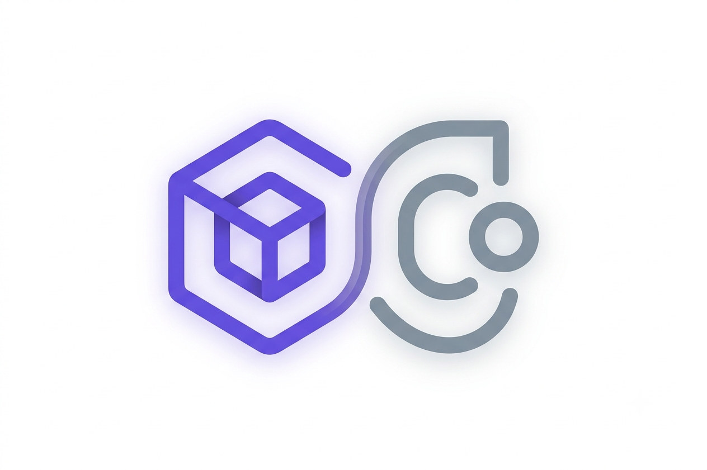

<p align="center">
  
</p>

# TerraCarbon Cost Optimization — Terraform Infrastructure

Modular Terraform implementation of Azure's TerraCarbon cost optimization
sustainability automation pattern. It deploys a Resource Group, Log
Analytics Workspace, Key Vault, Automation Account (with a PowerShell
runbook + schedules), Storage Account, and a Logic App that triggers
optimization runs based on real-time grid carbon intensity.

---

## Architecture

```
carbon-optimization/
├── main.tf                  # root: wires all modules together
├── variables.tf              # root input variables
├── outputs.tf                 # root outputs
├── terraform.tfvars           # YOUR environment values (never commit)
├── .gitignore
└── modules/
    ├── resource_group/
    ├── log_analytics/
    ├── key_vault/
    ├── automation_account/    # includes runbook.ps1
    ├── storage_account/
    └── logic_app/
```

**Flow:** Logic App (daily Recurrence trigger at 02:00 UTC) → calls UK Carbon
Intensity API → if intensity is low, starts the Automation Runbook via
Managed Service Identity → runbook reads thresholds from Key Vault → pulls
Azure Carbon Optimization emissions data → flags over-provisioned VMs →
everything logged to Log Analytics.

---

## 1. Prerequisites

| Tool | Minimum version | Check |
|---|---|---|
| Terraform | `>= 1.7.0` | `terraform -version` |
| Azure CLI | `>= 2.60.0` | `az version` |
| Azure subscription | Owner or User Access Administrator (for role assignments) | `az account show` |

Install if needed:

```bash
# macOS
brew install terraform azure-cli

# Ubuntu/Debian
curl -sL https://aka.ms/InstallAzureCLIDeb | sudo bash
sudo apt-get install -y terraform
```

Authenticate before anything else:

```bash
az login
az account set --subscription "<YOUR_SUBSCRIPTION_ID>"
```

---

## 2. ⚠️ Required first step — bootstrap the remote state backend

This project uses an **Azure Blob Storage backend** for Terraform state.
This storage account is **not** managed by this Terraform project — it must
exist *before* you run `terraform init`.

```bash
RG_STATE="rg-terraform-state"
LOCATION="westeurope"
STORAGE_ACCOUNT="stterraformstate$RANDOM"
CONTAINER="tfstate"

az group create --name "$RG_STATE" --location "$LOCATION"

az storage account create \
  --name "$STORAGE_ACCOUNT" \
  --resource-group "$RG_STATE" \
  --location "$LOCATION" \
  --sku Standard_LRS \
  --kind StorageV2 \
  --min-tls-version TLS1_2 \
  --allow-blob-public-access false

az storage container create \
  --name "$CONTAINER" \
  --account-name "$STORAGE_ACCOUNT" \
  --auth-mode login

echo "Your state storage account is: $STORAGE_ACCOUNT"
```

> 🔴 **Do not skip this.** Without this, `terraform init` will fail or fall
> back to a local state file which is unsafe and not shared with teammates.

The `backend "azurerm"` block is already configured in `main.tf`:

```hcl
backend "azurerm" {
  resource_group_name  = "rg-terraform-state"
  storage_account_name = "stterraformstateXXXXX"   # from the step above
  container_name       = "tfstate"
  key                  = "TerraCarbon.tfstate"
}
```

---

## 3. Configure your environment

```hcl
# terraform.tfvars
location       = "westeurope"
project_suffix = "a3f"   # 3-6 lowercase alphanumeric chars, globally unique

tags = {
  purpose     = "sustainability"
  environment = "production"
  project     = "TerraCarbon"
}

# Optional — IPs allowed to reach the Key Vault firewall
# (your CI/CD runner IPs, VPN egress, etc.)
# Leave empty to rely solely on AzureServices bypass (managed identities only)
allowed_ip_ranges = []   # e.g. ["203.0.113.10/32"]

carbon_threshold_kg          = "100"
cost_threshold_usd           = "500"
min_carbon_reduction_percent = "10"
cpu_utilization_threshold    = "20"
log_retention_days           = 90
```

`terraform.tfvars` is in `.gitignore` — never commit it.

> **Note:** `tenant_id`, `admin_object_id`, and `subscription_id` no longer
> need to be set as variables — they are read automatically from the
> authenticated Azure CLI session via `data.azurerm_client_config.current`.

---

## 4. Deploy

```bash
terraform init       # downloads azurerm provider + connects to remote backend
terraform validate   # checks syntax and types
terraform plan        # preview all changes — review before applying
terraform apply        # creates all resources in Azure
```

First apply typically takes 3–6 minutes (Key Vault RBAC and Logic App role
assignments take the longest to propagate).

### Useful outputs after apply

```bash
terraform output resource_group_name
terraform output key_vault_uri
terraform output logic_app_name
terraform output automation_account_name
terraform output -json   # full machine-readable output
```

### Tear down

```bash
terraform destroy
```

> Note: Key Vault purge protection is enabled with a 90-day soft-delete
> retention. The same vault name cannot be reused until it is purged or the
> retention window expires.

---

## 5. Security posture

All controls below are **applied by default** in this codebase — no manual
steps required.

| Control | Where | Detail |
|---|---|---|
| Key Vault network firewall | `modules/key_vault/main.tf` | `default_action = "Deny"` — only Azure-internal managed identities bypass via `AzureServices`; add human IPs via `allowed_ip_ranges` |
| Key Vault soft-delete | `modules/key_vault/main.tf` | 90-day retention + purge protection enabled |
| Key Vault RBAC | `modules/key_vault/main.tf` | `enable_rbac_authorization = true`; no access policies |
| Storage shared-key access | `modules/storage_account/main.tf` | `shared_access_key_enabled = false` — managed identity only |
| Storage HTTPS enforcement | `modules/storage_account/main.tf` | `https_traffic_only_enabled = true` |
| Storage infrastructure encryption | `modules/storage_account/main.tf` | `infrastructure_encryption_enabled = true` |
| Storage soft-delete | `modules/storage_account/main.tf` | Blob + container 7-day retention |
| Automation local auth | `modules/automation_account/main.tf` | `local_authentication_enabled = false` — RBAC/MSI only |
| Automation → KV access | `modules/automation_account/main.tf` | `Key Vault Secrets User` (read-only) |
| Logic App → Automation | `modules/logic_app/main.tf` | `Automation Operator` (job execution only, not account config) |
| Automation API version | `modules/logic_app/main.tf` | GA `2023-11-01` (replaces deprecated `2020-01-13-preview`) |
| Diagnostic logs | `modules/automation_account/main.tf`, `modules/logic_app/main.tf` | JobLogs, JobStreams, WorkflowRuntime → Log Analytics |
| State file | `main.tf` | Remote Azure Blob backend with versioning |
| Secrets | `variables.tf`, `.gitignore` | No secrets in variables; `terraform.tfvars` and `*.tfstate` gitignored |
| Tags drift | `main.tf` | Removed `timestamp()` from tags — no longer causes spurious plan diffs |

### Verify security controls after deploy

```bash
# Key Vault should be "Deny"
az keyvault show --name kv-tc-<suffix> --query "properties.networkAcls.defaultAction"

# Storage shared key should be false
az storage account show --name sttc<suffix> --query "allowSharedKeyAccess"

# Logic App diagnostic settings should exist
az monitor diagnostic-settings list --resource <logic-app-resource-id>
```

---

## 6. Module reference

| Module | Creates | Depends on |
|---|---|---|
| `resource_group` | The container RG for everything | — |
| `log_analytics` | Workspace for all logs/audit trail | `resource_group` |
| `key_vault` | RBAC-enabled vault, network-locked, 4 threshold secrets, 90-day soft-delete | `resource_group` |
| `automation_account` | Account (local auth disabled), managed identity, runbook, 2 schedules, 4 role assignments, diagnostic settings | `key_vault`, `log_analytics` |
| `storage_account` | Backing storage (shared-key disabled, HTTPS-only, infra-encrypted) | `resource_group` |
| `logic_app` | Daily-triggered workflow, MSI auth to ARM Jobs API (2023-11-01), 3 role assignments, diagnostic settings | `automation_account`, `storage_account` |

---

## 7. Live Dashboard

The project includes a [Live Dashboard](dashboard.html) (`dashboard.html`)
to visualize carbon intensity, resource health, automation activity, and
cost trends.

1. **Deploy Terraform**: `terraform apply`
2. **Export outputs**: `terraform output -json > terraform_outputs.json`
3. **Open Dashboard**: double-click `dashboard.html` or host it locally
4. **Azure integration** (optional): click "Dashboard configuration" → set
   Subscription ID, Bearer token (`az account get-access-token --query accessToken -o tsv`),
   and Log Analytics Workspace ID

### Secure local hosting with Nginx

```powershell
./automate.ps1   # generates token.json + terraform_outputs.json and keeps them fresh
```

Use the provided [`nginx.conf`](nginx.conf) to host the dashboard and proxy
Azure API requests with the auto-refreshed token.

---

## 8. Troubleshooting

| Error | Fix |
|---|---|
| `A resource with the ID ... already exists` | Someone already deployed with the same `project_suffix` — pick a different one |
| `403 on Key Vault secret creation` | RBAC propagation lag — re-run `terraform apply` |
| `Storage account name taken` | Names are global in Azure — change `project_suffix` |
| `Backend init fails` | Verify the bootstrap storage account exists and you're on the right subscription (`az account show`) |
| `403 calling ARM Jobs API from Logic App` | Ensure the Logic App managed identity has `Automation Operator` on the Automation Account scope |
| `Key Vault access denied from pipeline` | Add your runner's egress IP to `allowed_ip_ranges` in `terraform.tfvars` |

---


Modular Terraform implementation of Azure's TerraCarbon cost optimization
sustainability automation pattern. It deploys a Resource Group, Log
Analytics Workspace, Key Vault, Automation Account (with a PowerShell
runbook + schedules), Storage Account, and a Logic App that triggers
optimization runs based on real-time grid carbon intensity.

---

## Architecture

```
carbon-optimization/
├── main.tf                  # root: wires all modules together
├── variables.tf              # root input variables
├── outputs.tf                 # root outputs
├── terraform.tfvars           # YOUR environment values (never commit)
├── backend.tf                # remote state configuration
├── .gitignore
└── modules/
    ├── resource_group/
    ├── log_analytics/
    ├── key_vault/
    ├── automation_account/    # includes runbook.ps1
    ├── storage_account/
    └── logic_app/
```

**Flow:** Logic App (daily Recurrence trigger) → calls UK Carbon Intensity
API → if intensity is low, starts the Automation Runbook via its managed
identity → runbook reads thresholds from Key Vault → pulls Azure Carbon
Optimization emissions data → flags over-provisioned VMs for action →
everything is logged to Log Analytics.

---

## 1. Prerequisites

| Tool | Minimum version | Check |
|---|---|---|
| Terraform | `>= 1.7.0` | `terraform -version` |
| Azure CLI | `>= 2.60.0` | `az version` |
| Azure subscription | Owner or User Access Administrator (for role assignments) | `az account show` |

Install if needed:

```bash
# macOS
brew install terraform azure-cli

# Ubuntu/Debian
curl -sL https://aka.ms/InstallAzureCLIDeb | sudo bash
sudo apt-get install -y terraform
```

Authenticate before anything else:

```bash
az login
az account set --subscription "<YOUR_SUBSCRIPTION_ID>"
```

---

## 2. ⚠️ Required first step — bootstrap the remote state backend

This project uses an **Azure Blob Storage backend** for Terraform state
(see Security Notes below for why local state is unsafe). This storage
account is **not** managed by this Terraform project itself — it must
exist *before* you run `terraform init`, otherwise Terraform has nowhere
to store its own state.

Run this once, before touching the rest of the project:

```bash
# 1. Variables for the bootstrap (change suffix to something unique to you)
RG_STATE="rg-terraform-state"
LOCATION="westeurope"
STORAGE_ACCOUNT="stterraformstate$RANDOM"   # must be globally unique, lowercase, <=24 chars
CONTAINER="tfstate"

# 2. Create the resource group that will hold Terraform's own state
az group create \
  --name "$RG_STATE" \
  --location "$LOCATION"

# 3. Create the storage account for the state file
az storage account create \
  --name "$STORAGE_ACCOUNT" \
  --resource-group "$RG_STATE" \
  --location "$LOCATION" \
  --sku Standard_LRS \
  --kind StorageV2 \
  --min-tls-version TLS1_2 \
  --allow-blob-public-access false

# 4. Create the blob container that will hold the .tfstate file
az storage container create \
  --name "$CONTAINER" \
  --account-name "$STORAGE_ACCOUNT" \
  --auth-mode login

# 5. Print the storage account name — you'll need it in backend.tf
echo "Your state storage account is: $STORAGE_ACCOUNT"
```

> 🔴 **Do not skip this.** If you run `terraform init` before this storage
> account exists, Terraform will fail to initialize the backend, or — if
> you haven't configured a backend block yet — it will silently fall back
> to a local `terraform.tfstate` file on your machine, which is unsafe and
> not shared with teammates.

Now create (or update) `backend.tf` in the project root with the values
from step 5:

```hcl
# backend.tf
terraform {
  backend "azurerm" {
    resource_group_name  = "rg-terraform-state"
    storage_account_name  = "stterraformstateXXXXX"   # value from step 5 above
    container_name        = "tfstate"
    key                   = "carbon-optimization.tfstate"
  }
}
```

---

## 3. Configure your environment

Copy the example variables file and fill in your own values:

```bash
cp terraform.tfvars.example terraform.tfvars
```

```hcl
# terraform.tfvars
location       = "westeurope"
project_suffix = "a3f"   # any 3-6 char unique string, lowercase/numbers only

tags = {
  purpose     = "sustainability"
  environment = "production"
  project     = "carbon-optimization"
}

carbon_threshold_kg          = "100"
cost_threshold_usd            = "500"
min_carbon_reduction_percent = "10"
cpu_utilization_threshold    = "20"
```

`terraform.tfvars` is listed in `.gitignore` — it is loaded automatically,
never commit it if you add real secrets to it.

---

## 4. Deploy

```bash
terraform init       # downloads azurerm provider + connects to remote backend
terraform validate   # checks syntax
terraform plan        # preview what will be created — review this output
terraform apply        # creates everything in Azure
```

Expect ~6 resource groups' worth of resources across the 6 modules; first
apply typically takes 3–6 minutes (Key Vault and Logic App role
assignments take the longest to propagate).

### Useful outputs after apply

```bash
terraform output resource_group_name
terraform output key_vault_uri
terraform output logic_app_name
terraform output -json   # full machine-readable output
```

### Tear down

```bash
terraform destroy
```

> Note: if you enabled Key Vault purge protection (recommended, see below),
> the vault will remain in a soft-deleted state for its retention window
> even after destroy, and the same vault name cannot be reused until it is
> purged or the retention period expires.

---

## 5. Security hardening checklist (2026 baseline)

Apply these before treating this as production-ready:


`.gitignore` (place in project root):

```
terraform.tfvars
*.tfvars
.terraform/
.terraform.lock.hcl
*.tfstate
*.tfstate.*
crash.log
```

---

## 6. Module reference

| Module | Creates | Depends on |
|---|---|---|
| `resource_group` | The container RG for everything | — |
| `log_analytics` | Workspace for all logs/audit trail | `resource_group` |
| `key_vault` | RBAC-enabled vault + 4 threshold secrets | `resource_group` |
| `automation_account` | Account, managed identity, runbook, 2 schedules, 3 role assignments | `key_vault`, `log_analytics` |
| `storage_account` | Backing storage for Logic App state | `resource_group` |
| `logic_app` | Daily-triggered workflow + 3 role assignments | `automation_account`, `storage_account` |

---

## 7. Live Dashboard

The project includes a [Live Dashboard](file:///d:/TerraCarbon/dashboard.html) (`dashboard.html`) to visualize carbon intensity, resource health, automation activity, and cost trends.

### How to use:
1. **Deploy Terraform**: Run `terraform apply`.
2. **Generate Outputs**: Export output variables to a JSON file in the root directory:
   ```bash
   terraform output -json > terraform_outputs.json
   ```
3. **Open Dashboard**: Double-click `dashboard.html` or host it locally.
4. **Configure Azure Integration** (optional):
   - Click "Dashboard configuration" in the dashboard.
   - Set Azure Subscription ID, a Bearer Token (run `az account get-access-token --query accessToken -o tsv`), and the Log Analytics Workspace ID to load live cost and run logs.

### Secure Automation with Nginx:
To automate token and output refreshes securely:
1. Run the automation script in PowerShell:
   ```powershell
   ./automate.ps1
   ```
   This generates `token.json` and `terraform_outputs.json` dynamically and keeps them updated.
2. Use the provided [nginx.conf](file:///d:/TerraCarbon/nginx.conf) to host the dashboard and proxy Azure API requests securely using the dynamically refreshed token.

---

## 8. Troubleshooting

- **`Error: A resource with the ID ... already exists`** — someone already
  deployed with the same `project_suffix`; pick a new one.
- **403 on Key Vault secret creation** — RBAC role propagation can lag a
  few seconds; re-run `terraform apply`.
- **Storage account name taken** — names are global across all of Azure;
  change `project_suffix`.
- **Backend init fails** — double check the storage account from Section 2
  actually exists and you're logged into the right subscription
  (`az account show`).

---
